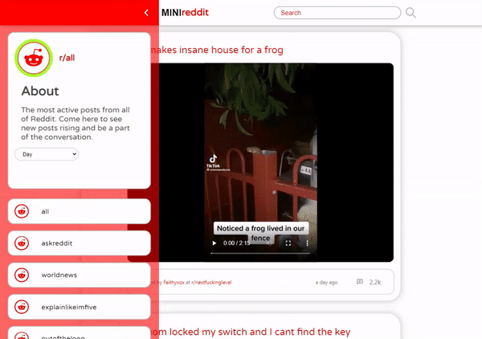

# MINIreddit <!-- omit in toc -->
## Table of Contents <!-- omit in toc -->
- [Introduction](#introduction)
- [Codebase](#codebase)
  - [Technologies](#technologies)
  - [Folder Structure](#folder-structure)
  - [Setup Process](#setup-process)
- [Features](#features)
  - [Side Menu](#side-menu)
  - [Time Filter Functionality](#time-filter-functionality)
  - [Search Functionality](#search-functionality)
  - [Post and Comments Loading Component](#post-and-comments-loading-component)
- [Acknowledgements](#acknowledgements)
- [Future Updates](#future-updates)

# Introduction
**MINIreddit** is a single-page React application with a simple, minimalist interface designed for browsing Reddit posts and comments from pre-selected subreddits by fetching data from the Reddit JSON API. I built this as a personal project to practice my **React and Redux** skills. I mainly used **Redux's Async Middleware** to connect to and fetch data from APIs. Additionally, I practiced scraping the incoming data from the API to extract the specific information needed for the Reddit client.

<br />
<p align="center">
  
</p>
<br />

# Codebase
## Technologies
This codebase consists of JavaScript, HTML and CSS.

Frameworks/Libraries Used:
- ReactJS
- Redux
<br />

## Folder Structure
```sh
minireddit/
├── public                  # Public files
└── src                     # Source files
minireddit/src
├── api                     # Files concerning conecting to API
├── app                     # App files
├── components              # Reusable components
├── features                # Feature components
├── resources               # Resources
├── store                   # Redux store and slices
└── utils                   # Utility functions
```
<br />

## Setup Process
- Clone or download the repo
- Open the directory and run `npm install` to install
- Run development application by using `npm start`
<br />

# Features
## Side Menu
The side menu is the primary method for navigating between predefined subreddits and selecting the timeframe for posts. The displayed posts are the top 25 posts filtered by the selected time: day, month, year, or all time. Additionally, this component displays a brief description of the selected subreddit.
<br />
<p align="center">
  
</p>
<br />

## Time Filter Functionality
As mentioned in the previous section, the Reddit client features a time selector that allows users to filter displayed posts based on their timeframe. Users can choose to see the top 25 posts of the day, month, year, or all time for the selected subreddit. This provides a convenient way to browse the most popular posts within a specific timeframe.
<br />
<p align="center">
  
</p>
<br />

## Search Functionality
The Reddit client also includes a simple search functionality. When the user clicks "enter" or "submit" after entering a search term in the search bar, the client makes a call to the Reddit API to retrieve up to 50 posts from an endpoint that matches the user's search query.
<br />
<p align="center">
  
</p>
<br />

## Post and Comments Loading Component
These are loading components that I designed to be displayed while the fetch request to the Reddit API is being handled in order to load the posts and, when clicked on, the comments of the post the user wants to read.
<br />
<p align="center">
  
</p>
<br />
<p align="center">
  
</p>
<br />

# Acknowledgements
These other dependencies used to build this project:
- react-icons

# Future Updates
In the future, if I have time, I plan to enhance this project by adding more features to improve the user experience. Some of these features include 
- [ ] Being able to vote for posts and comments
- [ ] Adding the ability to comment on posts
- [ ] Displaying each user's Reddit avatar in the comments section.

These additional features will make the Reddit client more interactive and engaging for users.